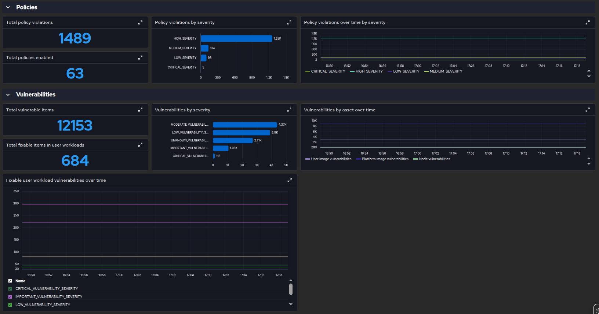

# Sample Perses configuration

The provided [datasource template](datasource.yaml.tpl) takes the Prometheus
service as `${PROMETHEUS_SERVICE}` in the selected `${NAMESPACE}`, because each
deployment path publishes its own:

- [monitoring stack](../cluster-observability-operator) — `sample-rhacs-prometheus`,
  which COO names after the `MonitoringStack`. `example-openshift-setup.sh`
  renders and applies the template for you.
- [prometheus-operator](../prometheus-operator) — `sample-stackrox-prometheus-server`,
  published by [service.yaml](../prometheus-operator/service.yaml).

Neither path uses `prometheus-operated`. The operator reconciles that headless
service to govern the StatefulSet, and its selector matches every Prometheus in
the namespace, so it is not a stable target for a datasource.

For any other installation, set `PROMETHEUS_SERVICE` to a service that addresses
your Prometheus, or change `spec.config.plugin.spec.proxy.spec.url` directly.

The [dashboard](dashboard.yaml) references some predefined metrics, and some that need to be enabled at the RHACS side.

Available by default:

- `rox_central_health_cluster_info`
- `rox_central_cfg_total_policies`
- `rox_central_cert_exp_hours`

Need to be enabled via UI or API:

- `rox_central_image_vuln_namespace_severity`, with Cluster, Namespace,
  IsPlatformWorkload, IsFixable, and Severity labels. The asset chart splits
  image vulnerabilities by IsPlatformWorkload; the other vulnerability charts
  aggregate or filter this same metric.
- `rox_central_node_vuln_node_severity`, with at least Cluster label.
- `rox_central_policy_violation_namespace_severity`, with at least Cluster, Namespace, and Severity labels.

See [configuring metrics via API](../rhacs/README.md#configuring-metrics-via-api)
for a command that enables all three customizable metrics with these labels.

The vulnerabilities-by-severity chart sums namespace-level counts across the
selected clusters and namespaces. The dashboard defaults to 24 hours so newly
collected metrics remain visible. The sample monitoring stack retains one day
of metrics, while the standalone Prometheus sample retains 30 days. Adjust
retention if you need more history.

If **Total policies enabled** reads zero, query
`rox_central_cfg_total_policies` in Prometheus and inspect its `Enabled` label.
RHACS emits `Enabled="true"` for enabled policies, and the dashboard sums only
that series. The counts are subject to the metrics reader's access scope;
check that the scraping identity can see policies if the source metric is zero.
If the image charts are empty, verify that `rox_central_image_vuln_namespace_severity`
is exposed with the labels above and that Prometheus has scraped it after the
metrics configuration was updated.

